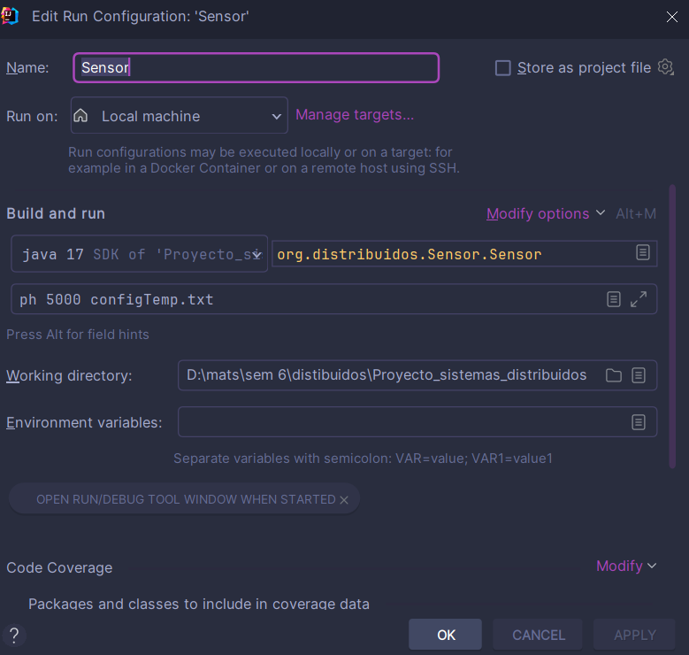

# Proyecto_sistemas_distribuidos (ES)

## Sensor

El programa `Sensor` simula la lectura de datos de diferentes tipos de sensores (temperatura, oxígeno, pH) y publica los resultados a través de ZeroMQ. A continuación, se detallan los puntos clave:

### Parámetros de Entrada
- **Tipo de Sensor (`args[0]`):** Especifica el tipo de sensor (temperatura, oxígeno, pH).
- **Intervalo de Envío (`args[1]`):** Especifica el intervalo de tiempo entre envíos de datos.
- **Archivo de Configuración (`args[2]`):** Contiene información sobre los tipos de mensajes y sus probabilidades.

### Funcionamiento
1. **Validación de Parámetros:** Verifica que se proporcionen los tres parámetros requeridos.
2. **Validación del Tipo de Sensor:** Asegura que el tipo de sensor sea válido (temperatura, oxígeno, pH).
3. **Lectura del Archivo de Configuración:** Lee un archivo de configuración que contiene probabilidades asociadas a tipos de mensajes.
4. **Generación de Datos Aleatorios:** Genera valores aleatorios según el tipo de sensor y el tipo de mensaje seleccionado.
5. **Publicación de Mensajes:** Utiliza ZeroMQ para publicar los mensajes en un canal.

### Clases Auxiliares
- **`MessageType`:** Clase que representa un tipo de mensaje junto con su probabilidad.
- **`selectMessageType`:** Método para seleccionar un tipo de mensaje aleatorio basado en la probabilidad.

---

## Monitor

El programa `Monitor` actúa como un suscriptor de los datos generados por el programa `Sensor`. A continuación, se describen sus características principales:

### Parámetros de Entrada
- **Tipo de Sensor (`args[0]`):** Especifica el tipo de sensor del cual se suscribirá para recibir datos.

### Funcionamiento
1. **Conexión al Canal de Suscripción:** Se conecta al canal de suscripción de ZeroMQ en la dirección IP especificada.
2. **Suscripción al Tipo de Sensor:** Se suscribe a mensajes específicos del tipo de sensor.
3. **Recepción y Visualización de Mensajes:** Recibe mensajes del canal de suscripción y los imprime en la consola.
4. **Lógica de Validación y Almacenamiento:** Se espera que se implemente la lógica para validar y almacenar las mediciones recibidas (en la sección comentada).

## Ejecucion en IntelliJ

Para poder ejecutar de manera adecuada los programas se tiene que agregar los 
argumentos en la configuración de compilación de los programas, de lo contrario
no se podrán ejecutar, cabe resaltar que todo esto dentro del entorno de 
desarrollo IntelliJ

## Autores

- [@davidfer1112](https://github.com/davidfer1112)

## Distributed_systems_project (EN)

## Sensor

The `Sensor` program simulates reading data from different types of sensors (temperature, oxygen, pH) and publishes the results through ZeroMQ. The key points are detailed below:

### Input Parameters.
- Sensor Type (`args[0]`):** Specifies the sensor type (temperature, oxygen, pH).
- Send Interval (`args[1]`):** Specifies the time interval between data sends.
- Configuration file (`args[2]`):** Contains information about the types of messages and their probabilities.

### Operation
1. **Parameter Validation:** Verifies that the three required parameters are provided.
2. **Sensor Type Validation:** Ensures that the sensor type is valid (temperature, oxygen, pH).
3. **Read Configuration File:** Reads a configuration file containing probabilities associated with message types.
4. **Random Data Generation:** Generates random values according to the sensor type and the selected message type.
5. **Message Publishing:** Uses ZeroMQ to publish messages to a channel.

### Auxiliary Classes
- **`MessageType`:** Class representing a message type along with its probability.
- **`selectMessageType`:** Method to select a random message type based on probability.

---

## Monitor

The `Monitor` program acts as a subscriber to the data generated by the `Sensor` program. Its main features are described below:

### Input Parameters
- **Sensor Type (`args[0]`):** Specifies the type of sensor to subscribe to receive data from.

### Operation
1. **Connection to Subscription Channel:** Connects to the ZeroMQ subscription channel at the specified IP address.
2. **Subscription to Sensor Type:** Subscribes to messages specific to the sensor type.
3. **Message Receive and Display:** Receives messages from the subscription channel and prints them to the console.
4. **Validation and Storage Logic:** Logic is expected to be implemented to validate and store the received measurements (in the commented section).

## Execution in IntelliJ

In order to properly execute the programs, the arguments have to be added in the IntelliJ compilation configuration.
arguments in the compilation configuration of the programs, otherwise they cannot be executed.
otherwise they will not be able to be executed, it is worth mentioning that all this within the IntelliJ development environment.
development environment IntelliJ

## Authors

- [@davidfer1112](https://github.com/davidfer1112)

